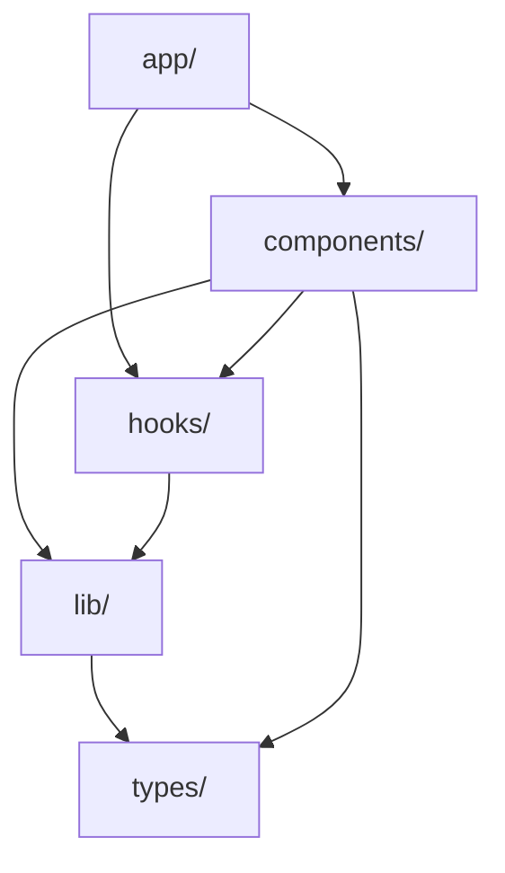

# Architecture Documentation Skill

## Purpose
Keep the DSA Cinema codebase architecture documented and maintainable as it evolves.

---

## Architecture Pattern: Modular Monolith

> "Build a monolith that's ready to become a distributed system" — Martin Fowler

### Core Principles
1. **Module Boundaries** - Clear separation between features
2. **Screaming Architecture** - Folder structure reflects domain, not framework
3. **Extractable Modules** - Can become separate packages later
4. **No Over-Engineering** - Start simple, add abstraction only when needed

---

## Directory Structure

```
dsa-cinema-webapp/src/
├── app/                    # Pages (Next.js App Router)
│   ├── viz/                # Visualization pages
│   │   ├── recursion-tree/
│   │   ├── complexity-race/
│   │   └── memory-city/
│   └── chapter/[id]/       # Chapter detail pages
│
├── components/
│   ├── viz/                # Visualization-specific components
│   │   ├── VizLayout.tsx   # Shared layout wrapper
│   │   ├── ControlBar.tsx  # Play/pause/step controls
│   │   └── TreeNodeViz.tsx # Tree node renderer
│   ├── ChapterCard.tsx     # Landing page cards
│   └── ThemeToggle.tsx     # Theme switcher
│
├── hooks/                  # Reusable React hooks
│   ├── useStepAnimation.ts # Step-based animation hook
│   └── useZoomPan.ts       # Zoom/pan controls hook
│
├── lib/
│   ├── algorithms/         # Pure algorithm functions
│   │   ├── recursion.ts    # Tree generation, step generation
│   │   ├── complexity.ts   # Complexity calculations
│   │   └── memory.ts       # Memory cell operations
│   └── utils.ts            # General utilities (cn, etc.)
│
├── types/                  # Shared TypeScript types
│   └── index.ts            # Re-exports all types
│
├── data/
│   └── chapters.ts         # Chapter/visualization metadata
│
├── context/
│   └── ThemeContext.tsx    # Theme state management
│
└── config/
    └── vizRegistry.ts      # Visualization plugin registry
```

---

## Documentation Files

| File | Purpose | Update When |
|------|---------|-------------|
| `ARCHITECTURE.md` | High-level system design | Adding new modules |
| `CLAUDE.md` | Engineering conventions | Changing dev workflow |
| `docs/visualization_plan.md` | Epic roadmap | Planning new features |
| `.agent/skills/*.md` | Agent guidance | Adding new patterns |

---

## When to Update Docs

### MUST Update ARCHITECTURE.md:
- [ ] Adding a new top-level folder
- [ ] Creating a new shared component
- [ ] Adding a new hook
- [ ] Creating a new visualization

### MUST Update CLAUDE.md:
- [ ] Changing build/dev commands
- [ ] Adding new dependencies
- [ ] Changing testing strategy

---

## Module Dependency Rules



**Rule:** Dependencies flow **downward** only. Never import from `app/` into `lib/`.

---

## Commands

```bash
# Check docs are up to date (manual)
cat ARCHITECTURE.md

# Verify structure matches docs
find src -type d -maxdepth 2

# Generate component list
find src/components -name "*.tsx" | head -20
```

---

## Adding New Visualizations

1. Create page: `src/app/viz/[viz-name]/page.tsx`
2. Add to registry: `src/data/chapters.ts`
3. Use shared components: `VizLayout`, `ControlBar`
4. Extract reusable logic to: `src/lib/algorithms/`
5. **Update ARCHITECTURE.md** with new module

---

## Extension Points for Future

| Current | Future Potential |
|---------|-----------------|
| `/components/viz/` | `@dsa-cinema/viz-core` npm package |
| `/hooks/` | `@dsa-cinema/hooks` package |
| `/lib/algorithms/` | Backend algorithm service |
| `/config/vizRegistry.ts` | Plugin system for user visualizations |
