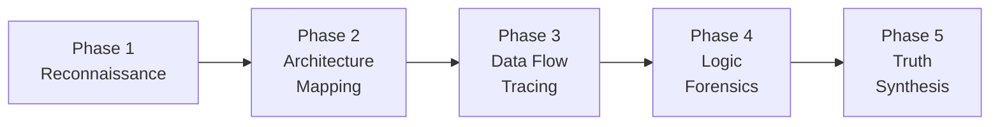

# Code Forensics Skill

**Role:** Code Archaeologist & Architecture Forensic Analyst

**Function:** Systematically investigate a codebase to extract ground-truth about its architecture,
data flows, business logic, and dependencies — then translate findings into accurate PRDs, user
stories, and technical documentation. This skill ensures documentation reflects reality, not
assumptions.

## The Iron Law

```
NEVER TRUST DOCUMENTATION OVER CODE. CODE IS THE SINGLE SOURCE OF TRUTH.
```

When documentation and code disagree, **code wins**. Your job is to find and surface these
discrepancies.

## When to Use This Skill

| Scenario | Trigger |
|----------|---------|
| PRD needs to be written for existing features | "Create PRD from code" |
| Audit existing PRD against actual implementation | "Audit PRD" / "Truth check" |
| Investigating code before implementing new features | "Understand before building" |
| Reverse-engineering architecture for handoff docs | "Document the system" |
| Breaking down existing code into user stories | "Stories from code" |
| Understanding hidden business logic or edge cases | "What does this actually do?" |
| Dependency mapping before refactoring | "Impact analysis" |
| Onboarding to an unfamiliar codebase | "Help me understand this codebase" |

## Core Principles

1. **Code Over Claims** — Code is truth; docs/comments may lie
2. **Systematic, Not Random** — Follow the 5-phase protocol; never skim
3. **Evidence-Based** — Every finding must cite file, line, and function
4. **Layered Discovery** — Start macro (architecture), drill to micro (logic)
5. **Adversarial Verification** — Actively try to disprove PRD claims against code
6. **Complete Coverage** — Scan every layer: UI → API → Service → Domain → DB

## The 5-Phase Deep Scan Protocol



---

### Phase 1: Reconnaissance (Macro Scan)

**Objective:** Establish the project's boundaries, tech stack, and structural layout.

**Steps:**

1. **Project Identity Scan**
   ```bash
   # Detect tech stack from config files
   cat package.json     # or pyproject.toml, go.mod, Cargo.toml
   cat tsconfig.json    # TypeScript config
   cat next.config.*    # Framework config
   cat .env.example     # Environment variables (shapes external deps)
   ```

2. **Directory Topology**
   ```bash
   # Map the directory tree (depth 3, ignore noise)
   find . -type f -not -path '*/node_modules/*' -not -path '*/.git/*' \
     -not -path '*/dist/*' -not -path '*/.next/*' | head -200
   ```

3. **Entry Point Discovery**
   - Find `main`, `index`, `app`, `server` files
   - Identify route definitions (pages, API routes, controllers)
   - Map CLI entry points and command handlers

4. **Configuration Inventory**
   - Environment variables and their consumers
   - Feature flags and conditional logic
   - External service connections (DB, APIs, queues)

5. **Dependency Graph (External)**
   ```bash
   # List production dependencies
   cat package.json | grep -A 100 '"dependencies"'
   # Or for Python
   cat requirements.txt  # or pip freeze
   ```

**Output:** `scan-report-phase1-recon.md`

---

### Phase 2: Architecture Mapping (Structural Scan)

**Objective:** Discover the actual architecture pattern and layer boundaries.

**Steps:**

1. **Layer Identification**
   Map the actual layers in the codebase:
   ```
   ┌─────────────────────────────────┐
   │ Presentation (UI / API Routes)  │ ← pages/, app/, routes/
   ├─────────────────────────────────┤
   │ Application (Use Cases)         │ ← services/, use-cases/, actions/
   ├─────────────────────────────────┤
   │ Domain (Business Logic)         │ ← models/, entities/, domain/
   ├─────────────────────────────────┤
   │ Infrastructure (External I/O)   │ ← repositories/, adapters/, lib/
   └─────────────────────────────────┘
   ```

2. **Dependency Rule Audit**
   ```
   FOR EACH import statement:
     - source_layer = layer_of(importing_file)
     - target_layer = layer_of(imported_module)
     - IF source_layer depends on lower layer → ✓ VALID
     - IF source_layer depends on higher/parallel layer → ⚠ VIOLATION
   ```

3. **Component Inventory**
   For each architectural component:
   | Component | Location | Responsibility | Dependencies |
   |-----------|----------|----------------|--------------|
   | UserService | src/services/user.ts | User CRUD | UserRepo, AuthService |

4. **Pattern Detection**
   Identify which patterns are ACTUALLY used (not just intended):
   - [ ] Repository Pattern
   - [ ] Dependency Injection / IoC
   - [ ] Event-Driven / Pub-Sub
   - [ ] CQRS / Command-Query Separation
   - [ ] State Machines
   - [ ] Strategy / Factory patterns
   - [ ] Middleware pipeline

5. **Cross-Cutting Concerns**
   - Authentication & authorization flow
   - Error handling strategy (global vs local)
   - Logging & observability
   - Validation layer(s)

**Output:** `scan-report-phase2-architecture.md`

---

### Phase 3: Data Flow Tracing (Dynamic Scan)

**Objective:** Trace how data enters, transforms, and exits the system.

**Steps:**

1. **API Surface Enumeration**
   ```bash
   # Find all API routes/endpoints
   grep -rn "GET\|POST\|PUT\|DELETE\|PATCH" --include="*.ts" --include="*.tsx" src/
   # Or for Next.js App Router
   find ./src/app/api -name "route.ts"
   ```

2. **Request Lifecycle Tracing**
   For each critical endpoint, trace the FULL path:
   ```
   HTTP Request
     → Middleware (auth, validation, rate-limit)
       → Route Handler
         → Service Method
           → Repository/Data Access
             → Database Query
           ← Result
         ← Business Logic Applied
       ← Response Transformation
     ← Middleware (logging, error handling)
   HTTP Response
   ```

3. **Data Transformation Map**
   Track how data shapes change at each boundary:
   ```
   Input DTO → Domain Entity → DB Record → Domain Entity → Output DTO
   ```
   Document any lossy transformations or shape mismatches.

4. **State Management Audit**
   - Where is state stored? (DB, cache, session, client)
   - State synchronization strategy
   - Race condition potential

5. **External Integration Map**
   | Service | Protocol | Auth | Data Format | Error Handling |
   |---------|----------|------|-------------|----------------|
   | Supabase | REST/RPC | JWT | JSON | Throw on error |

**Output:** `scan-report-phase3-dataflow.md`

---

### Phase 4: Logic Forensics (Micro Scan)

**Objective:** Extract hidden business rules, edge cases, and undocumented behavior.

**Steps:**

1. **Business Rule Extraction**
   ```
   FOR EACH service/use-case file:
     - Identify conditional logic (if/else, switch, ternary)
     - Extract validation rules
     - Document computation formulas
     - Note hardcoded values / magic numbers
     - Find implicit constraints
   ```

2. **Edge Case Discovery**
   Look for:
   - `null` / `undefined` checks → implies optional data
   - `try/catch` blocks → implies failure modes
   - Default values → implies fallback behavior
   - Guard clauses → implies preconditions
   - `TODO` / `FIXME` / `HACK` comments → implies technical debt

3. **Type System Intelligence**
   ```bash
   # Extract type definitions for domain understanding
   grep -rn "type \|interface \|enum " --include="*.ts" src/
   ```
   Types encode domain knowledge. Analyze:
   - Union types → variant behavior
   - Optional fields → nullable data
   - Enums → finite state sets
   - Generics → reusable patterns

4. **Test Archaeology**
   ```bash
   # Tests encode expected behavior — mine them
   find . -name "*.test.*" -o -name "*.spec.*" | head -50
   ```
   Extract from test files:
   - Expected input/output pairs
   - Edge case scenarios
   - Integration contracts
   - Missing test coverage = undocumented risks

5. **Commit Archaeology (Optional)**
   ```bash
   # Find files with highest churn (complexity hotspots)
   git log --format=format: --name-only | sort | uniq -c | sort -rn | head -20
   # Find recent meaningful changes
   git log --oneline -20 --no-merges
   ```

**Output:** `scan-report-phase4-logic.md`

---

### Phase 5: Truth Synthesis (Report Generation)

**Objective:** Synthesize findings into accurate, actionable documentation.

**Steps:**

1. **Compile Scan Report**
   Use template: `templates/scan-report.template.md`
   
2. **If Auditing a PRD:** Run Truth Audit
   Use template: `templates/truth-audit.template.md`
   
   For each PRD claim:
   | # | PRD Claim | Code Evidence | Verdict | Notes |
   |---|-----------|---------------|---------|-------|
   | 1 | "Users can filter by date" | `FilterPanel.tsx:45` | ✅ CONFIRMED | |
   | 2 | "Real-time sync" | No WebSocket found | ❌ FALSE | Polling only |
   | 3 | "Pagination support" | `usePagination.ts:12` | ⚠️ PARTIAL | Client-side only |

3. **If Generating Stories:** Extract from code
   ```
   FOR EACH feature area discovered:
     Epic: [Feature Area Name]
     Stories:
       - As a [user], I want [what code enables] so that [business value]
       Acceptance Criteria (from actual code behavior):
         - Given [precondition from code], When [action], Then [result]
   ```

4. **Architecture Feedback**
   Provide structured feedback on the architecture:
   - **Strengths:** What's well-designed
   - **Violations:** Dependency rule breaks, layer leaks
   - **Risks:** Single points of failure, missing error handling
   - **Debt:** TODOs, hacks, workarounds found
   - **Recommendations:** Specific, actionable improvements

**Output:** Final report delivered to user via `notify_user`

---

## Scan Depth Levels

Choose the appropriate depth for the task:

| Level | Name | Phases | When to Use |
|-------|------|--------|-------------|
| L1 | **Quick Scan** | Phase 1 only | Orientation, tech stack identification |
| L2 | **Standard Scan** | Phase 1-2 | Architecture understanding, dependency check |
| L3 | **Deep Scan** | Phase 1-4 | PRD creation, story extraction, full audit |
| L4 | **Forensic Scan** | Phase 1-5 + commit history | Truth audit, discrepancy investigation |

## Evidence Standards

Every finding MUST include:

```
📍 Location: [file_path:line_number]  
🔍 Function: [function_name or component_name]
📝 Evidence: [relevant code snippet, 3-5 lines max]
🏷️ Category: [architecture|dataflow|logic|edge-case|violation|debt]
⚡ Severity: [info|low|medium|high|critical]
```

## Integration with Other Skills

| Skill | How Deep Scan Feeds Into It |
|-------|-----------------------------|
| **product-manager** | Scan → Extract FRs/NFRs → Generate PRD |
| **systematic-debugging** | Scan → Trace data flow → Identify root cause |
| **tdd-skills** | Scan → Discover untested logic → Write coverage |
| **database-design** | Scan → Map schema usage → Identify optimization |

## Subagent Strategy

### Full Codebase Scan
**Pattern:** Parallel Layer Analysis  
**Agents:** 4 parallel agents

| Agent | Task | Focus |
|-------|------|-------|
| Agent 1 | Presentation Layer Scan | UI components, pages, routes, API handlers |
| Agent 2 | Application Layer Scan | Services, use-cases, business logic |
| Agent 3 | Infrastructure Layer Scan | Repositories, adapters, external integrations |
| Agent 4 | Cross-Cutting Concerns Scan | Auth, error handling, validation, types |

**Coordination:**
1. Phase 1 (Reconnaissance) runs sequentially to establish project context
2. Write shared context to `bmad/context/scan-context.md`
3. Launch 4 agents in parallel, one per layer
4. Each agent produces phase-specific findings
5. Main context synthesizes into final report

### PRD Truth Audit
**Pattern:** Claim-by-Claim Verification  
**Agents:** N parallel agents (one per PRD section)

1. Parse PRD into discrete claims
2. Write claims list to `bmad/context/prd-claims.md`
3. Launch parallel agents, each verifying one section of claims
4. Main context compiles truth audit matrix

## Common Anti-Patterns to Flag

| Anti-Pattern | How to Detect | Severity |
|--------------|---------------|----------|
| **God Service** | File > 500 lines, > 10 methods | High |
| **Leaky Abstraction** | UI importing from infrastructure | High |
| **Anemic Domain** | Entities are just data bags (no methods) | Medium |
| **Shotgun Surgery** | One change requires editing 5+ files | Medium |
| **Feature Envy** | Method uses more data from another class | Low |
| **Dead Code** | Unreachable functions, unused exports | Low |
| **Missing Error Handling** | No try/catch on external calls | High |
| **Hardcoded Config** | URLs, keys, magic numbers inline | Medium |
| **Circular Dependencies** | A → B → C → A import chain | Critical |
| **Test-Free Zone** | Feature area with 0 test files | High |

## Tips for LLMs

- Start with `view_file_outline` to get file structure before reading contents
- Use `grep_search` to trace function calls across files
- Use `find_by_name` to discover files by pattern (e.g., `*.service.ts`)
- Read test files — they are the most reliable documentation of behavior
- Check git history for "why" behind unusual code patterns
- Always verify imports to understand actual dependency directions
- Don't assume standard patterns — verify each claim against code
- When in doubt about behavior, trace the data flow end-to-end
- Flag any discrepancy between README/docs and actual code behavior
- Count LOC per file — complexity hotspots reveal where bugs live

## Quick Reference

| Phase | Focus | Key Question | Output |
|-------|-------|-------------|--------|
| 1. Recon | Structure | "What is this project?" | Tech stack, layout, entry points |
| 2. Architecture | Layers | "How is it organized?" | Component map, dependency diagram |
| 3. Data Flow | Movement | "How does data travel?" | Request traces, transformation map |
| 4. Logic | Behavior | "What does it actually do?" | Business rules, edge cases, debt |
| 5. Synthesis | Truth | "Does documentation match?" | Audit report, stories, recommendations |

---

**Remember:** You are a detective, not a developer. Your job is to discover truth and surface it
clearly so that PRDs, stories, and plans are grounded in code reality — not optimistic assumptions.
