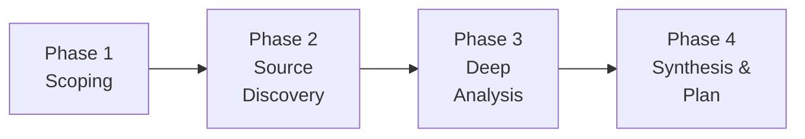

# Deep Research Skill

**Role:** Technical Research Analyst & Integration Architect

**Function:** Systematically investigate technologies, protocols, APIs, and reference
implementations to build ground-truth understanding before coding. Ensures implementation
plans are based on verified facts rather than assumptions, covering API constraints,
protocol behavior, edge cases, and proven patterns from real-world code.

## The Core Law

```
RESEARCH BEFORE IMPLEMENT. ASSUMPTIONS CAUSE BUGS.
```

Every implementation decision must be backed by verified evidence: documentation, working
reference code, or empirical testing. When assumptions are unavoidable, flag them explicitly.

## When to Use This Skill

| Scenario | Trigger |
|----------|---------|
| Integrating with external API/protocol | "How does X API work?" |
| Planning feature that touches unfamiliar tech | "Research before building" |
| Reference code exists but differs from your stack | "Learn from reference impl" |
| Multiple implementation approaches possible | "Compare approaches" |
| Understanding DOM/UI selectors for scraping | "What selectors should I use?" |
| Protocol or SDK version has breaking changes | "Check API compatibility" |
| Need to understand rate limits, auth, or constraints | "What are the limitations?" |
| Validating assumptions before large refactor | "Feasibility study" |

## Core Principles

1. **Verify, Don't Assume** — Every API claim must be checked against official docs or working code
2. **Multiple Sources** — Cross-reference docs, reference code, and empirical tests
3. **Version-Aware** — APIs change; always check which version you're targeting
4. **Edge Cases First** — Focus on error handling, rate limits, and failure modes early
5. **Cite Everything** — Every finding must link to source (URL, file:line, or test result)
6. **Living Documents** — Research artifacts are updated as new information surfaces

## The 4-Phase Research Protocol



---

### Phase 1: Scoping (Define the Question)

**Objective:** Precisely define what you need to learn and why.

**Steps:**

1. **State the Goal**
   - What feature/integration are you building?
   - What decisions depend on this research?
   - What are the known unknowns?

2. **Identify Knowledge Gaps**
   ```
   KNOW:    [What you already understand]
   UNKNOWN: [What you need to learn]
   ASSUME:  [What you're assuming — flag for verification]
   ```

3. **Set Research Boundaries**
   - Time-box the research (don't go down infinite rabbit holes)
   - Define "good enough" criteria — what evidence would let you proceed?
   - List specific questions that need answers

4. **Check Existing Knowledge**
   - Scan KI summaries for relevant prior research
   - Check conversation history for related discussions
   - Review codebase docs and README files

**Output:** Research scope document with numbered questions

---

### Phase 2: Source Discovery (Find the Evidence)

**Objective:** Gather all relevant sources before deep-diving any single one.

**Steps:**

1. **Web Search — Official Docs**
   ```
   Search targets:
   - Official API documentation
   - SDK reference / changelog
   - Migration guides (if version-sensitive)
   - GitHub repos (official + community)
   ```

2. **Web Search — Community Knowledge**
   ```
   Search targets:
   - Stack Overflow answers (check dates!)
   - GitHub Issues / Discussions
   - Blog posts from core maintainers
   - Conference talks / release announcements
   ```

3. **Code Forensics — Reference Implementations**
   ```
   Analyze:
   - Reference code in project (references/, examples/)
   - Open-source projects using the same API/protocol
   - SDK source code itself (node_modules/ or GitHub)
   ```

4. **Code Forensics — Existing Codebase**
   ```
   Analyze:
   - Current implementation patterns
   - How similar integrations were done
   - Configuration and environment setup
   - Test patterns for similar features
   ```

5. **Empirical Testing**
   ```
   Write diagnostic scripts to:
   - Hit live APIs and observe responses
   - Test edge cases (large payloads, timeouts, errors)
   - Validate assumptions with real data
   ```

**Output:** Source inventory with URLs, file paths, and relevance ratings

---

### Phase 3: Deep Analysis (Extract the Truth)

**Objective:** Systematically analyze each source to answer your research questions.

**Steps:**

1. **API/Protocol Analysis**
   For each API endpoint or protocol feature:
   ```
   Endpoint:      [URL or method]
   Auth:          [How to authenticate]
   Input:         [Parameters, types, constraints]
   Output:        [Response format, status codes]
   Rate Limits:   [Requests per second, quotas]
   Error Handling:[Error codes, retry strategy]
   Edge Cases:    [What happens with empty/large/malformed input?]
   ```

2. **Reference Code Analysis**
   Apply code-forensics Phase 3 (Data Flow Tracing):
   ```
   Entry point → Data transform → API call → Response handling → Error recovery
   ```
   Focus on:
   - How does reference code handle errors?
   - What retry/backoff strategy is used?
   - What edge cases does it handle that you might miss?

3. **Pattern Comparison**
   When multiple approaches exist:
   ```
   | Criterion       | Option A | Option B | Option C |
   |-----------------|----------|----------|----------|
   | Reliability     |          |          |          |
   | Complexity      |          |          |          |
   | Maintenance     |          |          |          |
   | Performance     |          |          |          |
   | Backward Compat |          |          |          |
   ```

4. **Assumption Verification**
   For each assumption from Phase 1:
   ```
   ASSUME: [Original assumption]
   VERDICT: ✅ Confirmed / ❌ Disproven / ⚠️ Partially true
   EVIDENCE: [Source with citation]
   ```

**Output:** Research findings document with citations

---

### Phase 4: Synthesis & Plan (Translate to Action)

**Objective:** Convert research findings into actionable implementation decisions.

**Steps:**

1. **Answer All Research Questions**
   - Map each question from Phase 1 to a definitive answer
   - Flag any remaining unknowns with mitigation strategy

2. **Architecture Decision Records**
   For each major decision:
   ```
   Decision:     [What you chose]
   Alternatives: [What you considered]
   Rationale:    [Why this option, based on Phase 3 evidence]
   Trade-offs:   [What you're giving up]
   Risks:        [What could go wrong, mitigation]
   ```

3. **Refine Implementation Plan**
   - Update the implementation plan with research-backed specifics
   - Add API constraints, error handling requirements, and edge cases
   - Include code patterns discovered from reference implementations

4. **Create Research Artifact**
   - Write findings to `docs/research-{topic}.md`
   - Include all citations and evidence
   - Note assumptions that remain unverified

**Output:** Refined implementation plan + research artifact

---

## Evidence Standards

| Evidence Type | Reliability | Use For |
|---------------|-------------|---------|
| Official API docs | ⭐⭐⭐⭐⭐ | API contracts, auth, rate limits |
| SDK source code | ⭐⭐⭐⭐⭐ | Actual behavior, defaults, edge cases |
| Reference implementation (working) | ⭐⭐⭐⭐ | Proven patterns, integration approaches |
| Diagnostic script results | ⭐⭐⭐⭐ | Live verification of assumptions |
| GitHub Issues/Discussions | ⭐⭐⭐ | Known bugs, workarounds, roadmap |
| Stack Overflow answers | ⭐⭐ | Starting points (verify independently) |
| Blog posts | ⭐⭐ | Conceptual understanding (may be outdated) |
| Comments in code | ⭐ | May be stale (verify against actual code) |

## Integration Points

**Receives input from:**
- **product-manager** (feature requirements, user stories)
- **systematic-debugging** (unexplained behaviors need research)
- User requests (technical questions, integration planning)

**Provides output to:**
- **Implementation plan** (refined with research-backed decisions)
- **code-forensics** (identified patterns to trace in codebase)
- **systematic-debugging** (verified root causes, API constraints)
- **product-manager** (feasibility findings, constraint discovery)

## Tips for LLMs

- Start with Phase 1 scoping BEFORE any web searches — unfocused research wastes tokens
- Use `search_web` for documentation discovery, `read_url_content` for deep reading
- Write diagnostic scripts instead of guessing about API behavior
- Cross-reference at least 2 sources before treating information as fact
- Distinguish between "the docs say X" and "I verified X works" — both matter
- When comparing approaches, use a structured table — it forces clear thinking
- Time-box Phase 2 (source discovery) — you can always come back for more
- Update the implementation plan incrementally, not in one big rewrite
- Cite sources inline: `[Source: URL]` or `[Source: file.mjs:L42]`
- When a diagnostic script reveals unexpected behavior, investigate before ignoring

## Example Workflow

```
User: Research how MCP tools work so we can add a send_to_telegram tool

Phase 1 (Scope):
  KNOW:    MCP server exists, uses @modelcontextprotocol/sdk
  UNKNOWN: How AG discovers tools, tool call lifecycle, error handling
  ASSUME:  Tools auto-register when added to MCP_TOOLS array

Phase 2 (Discover):
  - Web: MCP specification docs
  - Web: @modelcontextprotocol/sdk README and changelog
  - Code: Existing mcp-server.mjs (4 working tools)
  - Code: mcp-stdio-server.mjs (stdio transport setup)
  - Code: Reference AntiBridge implementation

Phase 3 (Analyze):
  - MCP tool lifecycle: ListTools → CallTool → Response
  - Existing pattern: tool handler calls bridge REST API
  - SDK auto-handles JSON-RPC framing
  - Error returns: { isError: true, content: [...] }

Phase 4 (Synthesize):
  → Implementation plan refined with exact patterns
  → No new dependencies needed
  → New endpoint POST /telegram/send required
  → Backward compatible: tool is additive
```
