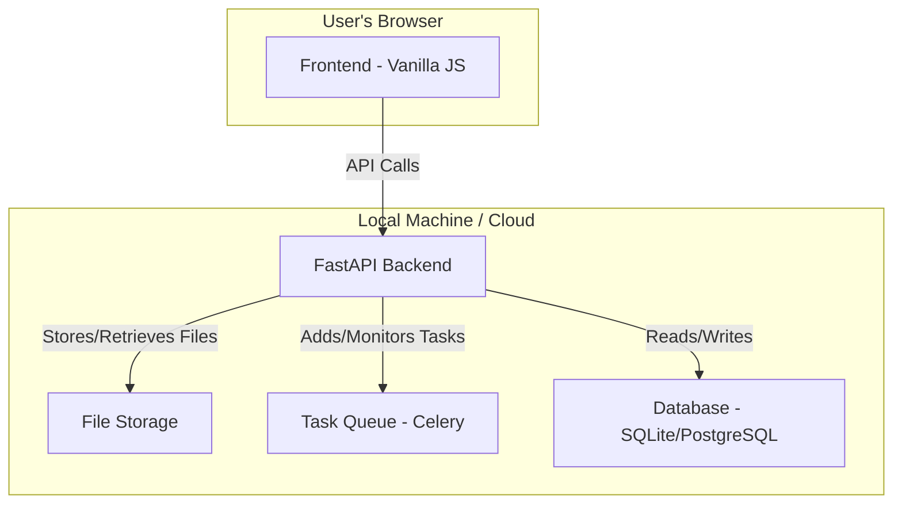
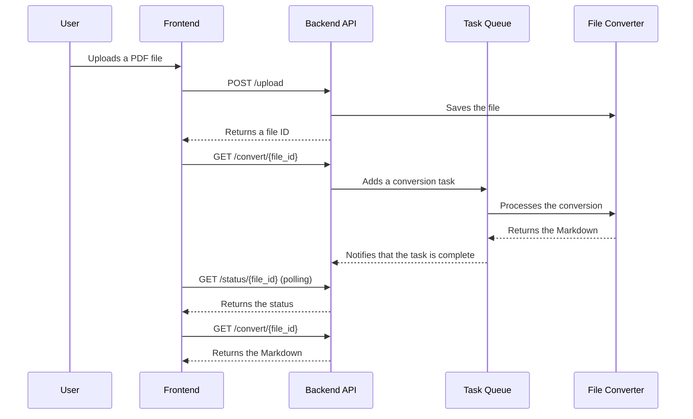

# SLR Paper-to-Markdown Converter Fullstack Architecture Document

## Introduction

This document outlines the complete fullstack architecture for the SLR Paper-to-Markdown Converter, including backend systems, frontend implementation, and their integration. It serves as the single source of truth for AI-driven development, ensuring consistency across the entire technology stack.

This unified approach combines what would traditionally be separate backend and frontend architecture documents, streamlining the development process for modern fullstack applications where these concerns are increasingly intertwined.

### Starter Template or Existing Project

N/A - Greenfield project

### Change Log

| Date       | Version | Description   | Author        |
| :--------- | :------ | :------------ | :------------ |
| 2025-08-13 | 1.0     | Initial draft | Winston (Architect) |

## High Level Architecture

### Technical Summary

The proposed architecture is a modern, API-first web application. The backend is a Python application built with the FastAPI framework, providing a RESTful API for all functionalities. The frontend is a lightweight, single-page application built with vanilla JavaScript, HTML, and CSS, designed for rapid development and future flexibility. The application will initially be deployed locally, with a clear path to future cloud deployment. The core of the architecture is the separation of concerns between the frontend and backend, which communicate exclusively through the API. This design ensures that the application is maintainable, scalable, and adaptable to future changes in technology.

### Platform and Infrastructure Choice

*   **Platform:** For the initial phase, the application will be designed for local deployment on the developers' machines. For future cloud deployment, a platform like Vercel for the frontend and a containerization solution like Docker for the backend on a cloud provider like AWS or Google Cloud would be a good choice.
*   **Key Services:**
    *   **Local:** Python, FastAPI, Uvicorn, a simple file-based storage for uploaded PDFs.
    *   **Cloud (Future):** Vercel (Frontend), Docker, AWS S3 (File Storage), AWS Fargate or Google Cloud Run (Backend), a managed database like RDS or Cloud SQL.
*   **Deployment Host and Regions:** Initially `localhost`. Future deployment regions will be chosen based on user location.

### Repository Structure

*   **Structure:** The project will be organized within the `docling_app` directory, which will contain both the backend and frontend code.

### High Level Architecture Diagram



### Architectural Patterns

*   **API-First:** The backend exposes a well-defined API that the frontend consumes. This decouples the two and allows for independent development and evolution.
*   **Repository Pattern:** The backend will use the repository pattern to abstract the data access logic, making it easier to switch databases in the future.
*   **Asynchronous Task Queue:** For handling the PDF conversion, which can be a long-running process, we will use a task queue like Celery. This will prevent the API from being blocked and will allow for better scalability.

## Tech Stack

| Category             | Technology      | Version | Purpose                               | Rationale                                                                 |
| :------------------- | :-------------- | :------ | :------------------------------------ | :------------------------------------------------------------------------ |
| Frontend Language    | JavaScript      | ES6+    | Building the user interface           | Universal language for the web                                            |
| Frontend Framework   | None (Vanilla JS) | -       | Rapid development of a simple UI      | Avoids framework overhead for the initial version, allows for future flexibility |
| Backend Language     | Python          | 3.10+   | Building the backend API              | Excellent for web development and has a rich ecosystem of libraries       |
| Backend Framework    | FastAPI         | latest  | Creating a high-performance API       | Modern, fast, and easy to use, with automatic API documentation           |
| API Style            | REST            | -       | Communication between frontend and backend | Simple, well-understood, and widely supported                             |
| Database             | SQLite          | -       | Local data storage for the MVP        | Simple, file-based database that is easy to set up for local development |
| File Storage         | Local Filesystem| -       | Storing uploaded PDFs for the MVP     | Simple and sufficient for local deployment                                |
| Backend Testing      | Pytest          | latest  | Testing the backend API               | Powerful and easy-to-use testing framework for Python                     |
| Build Tool           | None (for now)  | -       | -                                     | Not needed for the initial simple setup                                   |
| Bundler              | esbuild/Parcel  | latest  | Bundling frontend assets              | Fast and easy to configure                                                |
| CI/CD                | GitHub Actions  | -       | Automating tests and future deployments | Integrated with GitHub and easy to set up                                 |

## Data Models

### File

*   **Purpose:** Represents an uploaded PDF file.
*   **Key Attributes:**
    *   `id`: string - Unique identifier for the file.
    *   `name`: string - The original name of the file.
    *   `status`: string - The current conversion status ("pending", "processing", "completed", "failed").
    *   `created_at`: datetime - The timestamp when the file was uploaded.

### ConversionJob

*   **Purpose:** Represents a job to convert a file.
*   **Key Attributes:**
    *   `id`: string - Unique identifier for the job.
    *   `file_id`: string - The ID of the file to be converted.
    *   `status`: string - The status of the job.
    *   `result`: string - The converted Markdown text (if successful).
    *   `error_message`: string - The error message (if failed).

## API Specification

```yaml
openapi: 3.0.0
info:
  title: SLR Paper-to-Markdown Converter API
  version: 1.0.0
  description: API for converting PDF research papers to Markdown.
servers:
  - url: http://localhost:8000
    description: Local development server
paths:
  /upload:
    post:
      summary: Upload one or more PDF files
      requestBody:
        content:
          multipart/form-data:
            schema:
              type: object
              properties:
                files:
                  type: array
                  items:
                    type: string
                    format: binary
      responses:
        '200':
          description: A list of file IDs for the uploaded files.
  /convert/{file_id}:
    get:
      summary: Get the converted Markdown for a file
      parameters:
        - name: file_id
          in: path
          required: true
          schema:
            type: string
      responses:
        '200':
          description: The converted Markdown text.
        '404':
          description: File not found.
  /status/{file_id}:
    get:
      summary: Get the conversion status of a file
      parameters:
        - name: file_id
          in: path
          required: true
          schema:
            type: string
      responses:
        '200':
          description: The conversion status.
```

## Components

### Frontend

*   **FileUploader:** A component for uploading files (with drag-and-drop).
*   **FileListView:** A component for displaying the list of uploaded files and their status.
*   **PDFViewer:** A component for rendering the PDF.
*   **MarkdownViewer:** A component for rendering the Markdown.
*   **SideBySideView:** A component that combines the PDFViewer and MarkdownViewer.

### Backend

*   **API:** The FastAPI application that handles all API requests.
*   **FileConverter:** A module that contains the logic for converting PDFs to Markdown.
*   **TaskQueue:** A Celery task queue for handling asynchronous conversions.
*   **FileRepository:** A module that handles all interactions with the file storage.
*   **DatabaseRepository:** A module that handles all interactions with the database.

## Core Workflows

### PDF Conversion Workflow



## Database Schema

For the initial SQLite database, we will have two tables:

```sql
CREATE TABLE files (
    id TEXT PRIMARY KEY,
    name TEXT NOT NULL,
    status TEXT NOT NULL,
    created_at TEXT NOT NULL
);

CREATE TABLE conversion_jobs (
    id TEXT PRIMARY KEY,
    file_id TEXT NOT NULL,
    status TEXT NOT NULL,
    result TEXT,
    error_message TEXT,
    FOREIGN KEY (file_id) REFERENCES files (id)
);
```

## Unified Project Structure

```
docling/
├── .venv/
├── docling_app/
│   ├── __init__.py
│   ├── main.py
│   ├── api/
│   ├── core/
│   ├── db/
│   ├── static/
│   └── templates/
├── docs/
└── README.md
```

## Development Workflow

### Local Development Setup

*   **Prerequisites:** Python 3.10+
*   **Initial Setup:**
    ```bash
    pip install -r requirements.txt
    ```
*   **Development Commands:**
    ```bash
    # Start backend
    uvicorn docling_app.main:app --reload
    ```

## Security and Performance

*   **Security:**
    *   **Input Validation:** The backend will validate all file uploads to ensure they are PDFs.
    *   **CORS:** The backend will have a restrictive CORS policy to only allow requests from the frontend's origin.
*   **Performance:**
    *   **Asynchronous Processing:** The use of a task queue will ensure that the API remains responsive during conversions.
    *   **Frontend Performance:** The frontend will be lightweight and have minimal dependencies to ensure fast load times.

## Testing Strategy

*   **Backend:** Unit and integration tests for the API endpoints and the conversion logic using Pytest.
*   **Frontend:** Manual testing for the initial version.

## Coding Standards

*   **Backend:** Black for code formatting, isort for import sorting.
*   **Frontend:** Prettier for code formatting.

## Error Handling Strategy

The backend API will return standard HTTP error codes (e.g., 400 for bad requests, 404 for not found, 500 for server errors) with a consistent JSON error response body.

## Monitoring and Observability

For the initial local deployment, we will rely on console logs for monitoring. For future cloud deployment, we will integrate with a logging and monitoring service.
