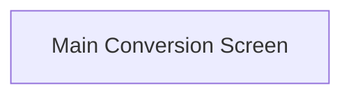
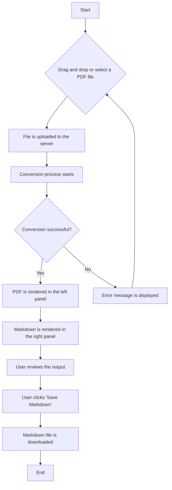

# SLR Paper-to-Markdown Converter UI/UX Specification

## Introduction

This document defines the user experience goals, information architecture, user flows, and visual design specifications for the SLR Paper-to-Markdown Converter's user interface. It serves as the foundation for visual design and frontend development, ensuring a cohesive and user-centered experience.

### Overall UX Goals & Principles

#### Target User Personas

*   **Primary:** Academic researchers, PhD students, and research teams who are conducting Systematic Literature Reviews and need an efficient way to extract text from PDFs for LLM analysis.

#### Usability Goals

*   **Streamlined Workflow:** The process of uploading, converting, and saving documents should be as fast and efficient as possible.
*   **Ease of Use:** The interface should be intuitive and require minimal learning, even for users who are not tech-savvy.
*   **Clarity of Output:** It should be easy for users to compare the original PDF with the converted Markdown to verify the quality of the conversion.

#### Design Principles

1.  **Clarity over Cleverness:** Prioritize a clear and understandable interface over novel or complex design patterns.
2.  **Focus on the Task:** The UI should be minimalist and centered around the core task of document conversion, avoiding unnecessary distractions.
3.  **Provide Feedback:** The user should always be aware of the system's status, whether it's uploading, converting, or has encountered an error.

### Change Log

| Date       | Version | Description   | Author      |
| :--------- | :------ | :------------ | :---------- |
| 2025-08-13 | 1.0     | Initial draft | Sally (UX)  |

## Information Architecture (IA)

### Site Map / Screen Inventory

For the MVP, the application will be a single-page application with one primary screen.

### Navigation Structure

*   **Primary Navigation:** None required for the MVP, as it is a single-page application.

## User Flows

### Convert a Single Paper

*   **User Goal:** To quickly and easily convert a single PDF paper into Markdown.
*   **Entry Points:** The user arrives at the main application page.
*   **Success Criteria:** The user successfully downloads a well-formatted Markdown file of their research paper.

#### Flow Diagram

#### Edge Cases & Error Handling:

*   **Invalid file type:** If the user uploads a file that is not a PDF, an error message should be displayed.
*   **Conversion error:** If the backend fails to convert the document, a user-friendly error message should be displayed.
*   **Large file size:** The UI should provide feedback for large file uploads and conversions that may take longer.

## Wireframes & Mockups

**Primary Design Files:** The high-fidelity mockups and prototypes will be created in Figma and a link will be provided here.

### Key Screen Layouts

#### Main Conversion Screen

*   **Purpose:** This is the main and only screen for the MVP. It allows users to upload a PDF, view the conversion, and save the result.
*   **Key Elements:**
    *   **File Upload Area:** A prominent area that allows users to either click to select a file or drag and drop a file.
    *   **Left Panel:** A view that renders the uploaded PDF.
    *   **Right Panel:** A view that renders the converted and formatted Markdown.
    *   **Save Button:** A button to save the converted Markdown.
*   **Interaction Notes:** The two panels should be scrollable independently. A "Save" button should be prominently displayed.

## Component Library / Design System

**Design System Approach:** We will start with a simple set of reusable components and evolve this into a more formal design system as the application grows.

### Core Components

*   **Button:** For actions like "Upload" and "Save".
*   **File Input:** A custom-styled file input that also supports drag-and-drop.
*   **Panel:** A container for the PDF and Markdown views.
*   **Progress Indicator:** A loading spinner or progress bar to indicate that the conversion is in progress.

## Branding & Style Guide

### Visual Identity

The brand is academic, professional, and minimalist. The UI should be clean and uncluttered.

### Color Palette

| Color Type | Hex Code  | Usage                               |
| :--------- | :-------- | :---------------------------------- |
| Primary    | `#007bff` | Buttons, links, and active elements |
| Secondary  | `#6c757d` | Secondary text, borders            |
| Success    | `#28a745` | Success messages, confirmations     |
| Warning    | `#ffc107` | Warnings, important notices         |
| Error      | `#dc3545` | Error messages, destructive actions |
| Neutral    | `#f8f9fa` | Backgrounds, panels                 |

### Typography

*   **Primary Font:** A sans-serif font like Inter or Lato for all UI text.
*   **Monospace Font:** A monospace font like Fira Code or Source Code Pro for the rendered Markdown.

## Accessibility Requirements

**Compliance Target:** WCAG 2.1 AA

### Key Requirements

*   **Visual:**
    *   All text should have a contrast ratio of at least 4.5:1.
    *   Focus indicators should be clearly visible on all interactive elements.
*   **Interaction:**
    *   All functionality should be accessible via the keyboard.
    *   The application should be navigable with a screen reader.
*   **Content:**
    *   All images and icons should have appropriate alternative text.
    *   The heading structure should be logical and hierarchical.

## Responsiveness Strategy

### Breakpoints

| Breakpoint | Min Width |
| :--------- | :-------- |
| Mobile     | 320px     |
| Tablet     | 768px     |
| Desktop    | 1024px    |

### Adaptation Patterns

*   **Mobile:** The side-by-side view will stack vertically.
*   **Tablet:** The side-by-side view will be maintained, but with smaller margins.
*   **Desktop:** The side-by-side view will have comfortable margins and spacing.

## Animation & Micro-interactions

*   **Loading states:** A subtle loading spinner will be displayed during file upload and conversion.
*   **Button clicks:** Buttons will have a subtle press animation.
*   **Notifications:** Success and error messages will fade in and out.

## Performance Considerations

*   **Page Load:** The initial page load should be under 2 seconds.
*   **Interaction Response:** All UI interactions should respond in under 100ms.

## Next Steps

1.  Create high-fidelity mockups in Figma based on this specification.
2.  Conduct usability testing with the target users to validate the design.
3.  Hand off the final designs and this specification to the development team.
